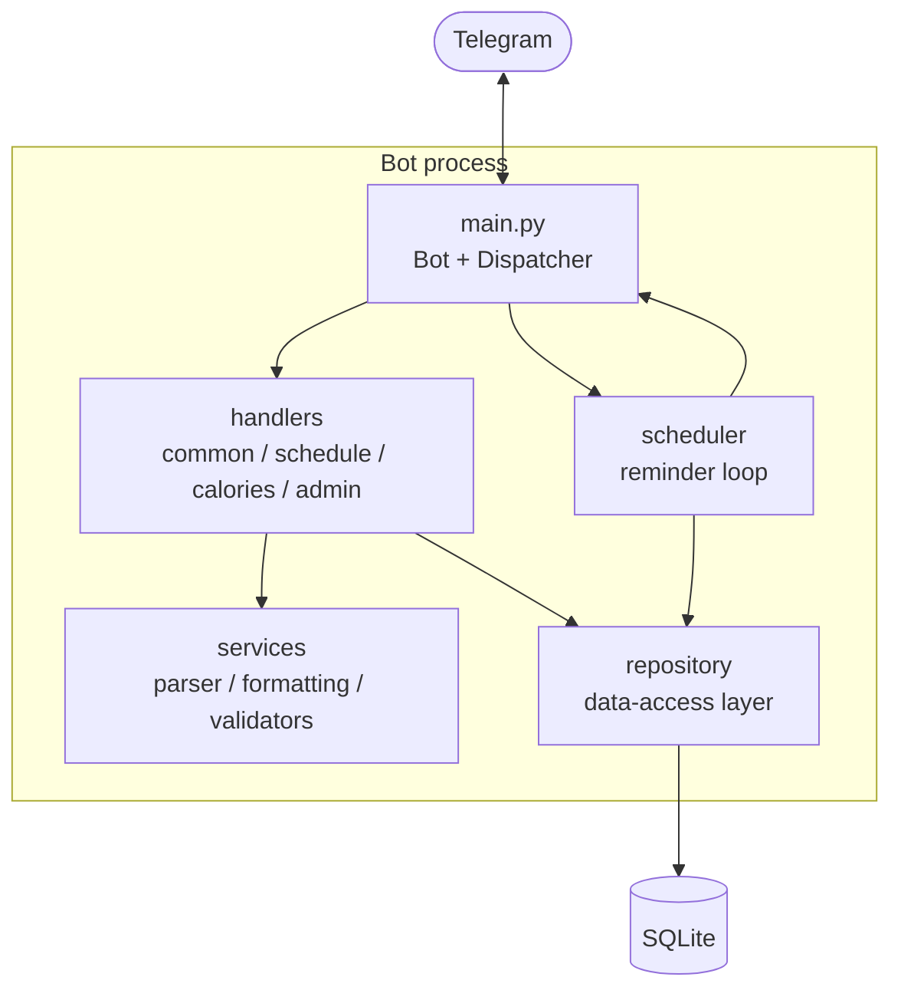
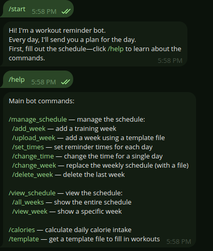
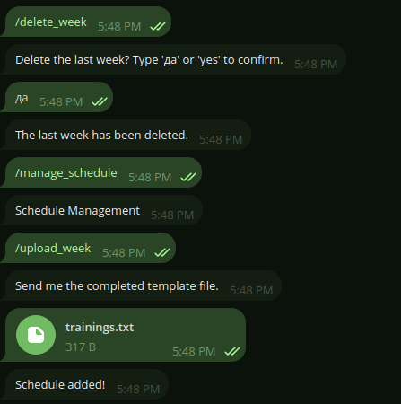
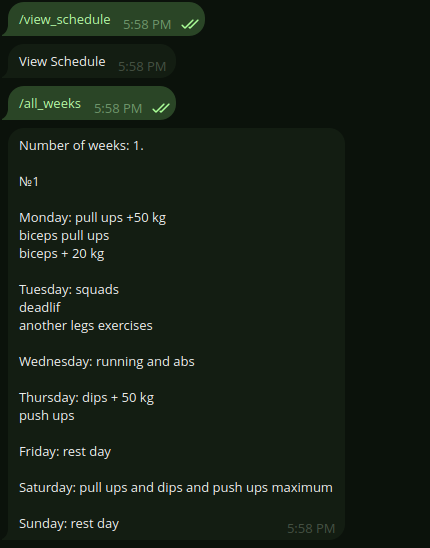
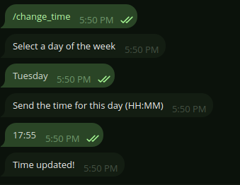
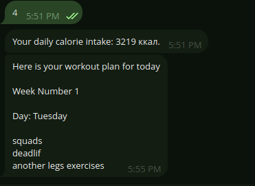
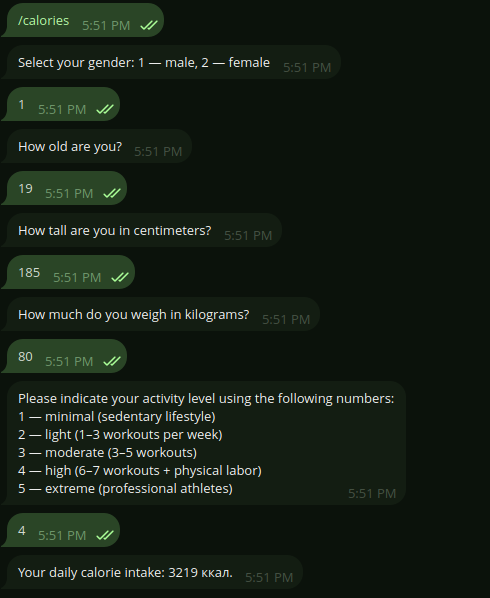

# Workout Reminder Bot

A Telegram bot that reminds you which workout to do on which day. 
You can save multi-week workout plans,
set a reminder time for each day, and the bot will automatically send you
today’s workout. 
Here’s how it works: for example, you’re riding the subway after a hard day and have completely forgotten about your workout and to-do list, but since you knew this would happen, you set a reminder for 8:00 p.m., and you’ll receive a message at exactly that time—it will even include instructions on exactly what to do.
Built using [aiogram 3] and SQLite.


## Features

- **Multi-week plans** — store up to five training weeks and cycle through them
  automatically, one week at a time.
- **Per-day reminders** — set an individual send time for every day of the week.
- **Daily workout push** — the bot messages you today's plan at your chosen time.
- **Two ways to add a plan** — fill it in step by step in chat, or upload a
  filled-in template file.
- **Full management** — view the whole plan or a single week, replace a week's
  plan, change a day's reminder time, or delete the last week.
- **Calorie calculator** — estimate your daily calorie needs with the
  Mifflin-St Jeor formula.

## Tech stack

| Area            | Choice                          |
| --------------- | ------------------------------- |
| Language        | Python 3.12                     |
| Bot framework   | aiogram 3.13                    |
| Storage         | SQLite (`sqlite3`, std library) |
| Scheduling      | asyncio background task         |
| Config          | python-dotenv, pytz             |

## Project structure

The project is organized in layers, so each file has a single responsibility.

```
workout-reminder-bot/
├── bot/
│   ├── main.py            # Entry point: wires everything together and starts polling
│   ├── config.py          # Loads settings (token, admins, timezone) from the environment
│   ├── states.py          # FSM states for every step-by-step dialog
│   ├── database/
│   │   ├── schema.py       # Table definitions and one-off DB initialization
│   │   └── repository.py   # Data-access layer — ALL SQL lives here, fully parameterized
│   ├── handlers/
│   │   ├── common.py       # /start, /help and menu navigation
│   │   ├── schedule.py     # Add / view / edit / delete weeks and reminder times
│   │   ├── calories.py     # Daily calorie calculator
│   │   └── admin.py        # Owner-only commands, guarded by an admin check
│   ├── keyboards/
│   │   └── reply.py        # Reply keyboard builders
│   └── services/
│       ├── scheduler.py    # Background loop that sends reminders when they are due
│       ├── plan_parser.py  # Parses an uploaded template file into a storable plan
│       ├── formatting.py   # Renders stored plans back into readable messages
│       └── validators.py   # Small input validators (time, weekday)
├── data/
│   └── template.txt        # The plan template sent to users via /template
├── .env.example            # Sample environment file — copy to .env
├── requirements.txt
└── README.md
```

The rule of thumb: **handlers never touch SQL directly** — they call methods on
`Repository`, which is the only place the database is accessed.

## Architecture



Incoming updates flow from Telegram into the dispatcher, which routes them to a
handler. Handlers use the service layer for logic and the repository for data.
The scheduler runs alongside as a background task, reading due reminders from the
repository and sending them back out through the bot.

## Getting started

### 1. Prerequisites

- Python 3.11 or newer
- A bot token from [@BotFather](https://t.me/BotFather)

### 2. Install

```bash
git clone https://github.com/MihailRubtsov/workout_reminder_bot_tg.git
cd workout-reminder-bot

python -m venv .venv
source .venv/bin/activate        # Windows: .venv\Scripts\activate

pip install -r requirements.txt
```

### 3. Configure

Copy the example environment file and fill in your token:

```bash
cp .env.example .env
```

```ini
# .env
BOT_TOKEN=123456:your-token-from-botfather
ADMIN_IDS=111111111          # comma-separated Telegram IDs (optional)
TIMEZONE=Europe/Vienna       # IANA timezone name used for reminders
DB_PATH=workout_bot.db       # SQLite file, created automatically
```

### 4. Run

The project is organized into the bot/ package, and the files within it reference each other by their full names—for example, `from bot.config import load_config`. 
These absolute imports immediately show which package each module comes from, making the structure easy to read.
For Python to understand where the `bot` package begins, you need to run the program from the project root—the folder that contains `bot`. The `-m` flag adds the root to the module search path and runs `main` by its import name, so all `from bot...` statements resolve correctly. 
If, however, you go inside `bot/` and run `python main.py`, Python won’t see the `bot` package “from above” and will crash with a `ModuleNotFoundError`.

Run from the **project root** as a module (not `python bot/main.py`):

```bash
python -m bot.main
```

The `-m` flag adds the current directory to Python's import path, which is what
lets the absolute `from bot....` imports resolve correctly.

## Commands

| Command            | What it does                                        |
| ------------------ | --------------------------------------------------- |
| `/start`           | Register and show the main menu                     |
| `/help`            | List all commands                                   |
| `/manage_schedule` | Open the schedule-management menu                   |
| `/add_week`        | Add a training week step by step                    |
| `/upload_week`     | Add a week from a filled-in template file           |
| `/set_times`       | Set reminder times for all seven days               |
| `/change_time`     | Change the reminder time for one day                |
| `/change_week`     | Replace an existing week's plan (via file)          |
| `/delete_week`     | Delete the last training week                       |
| `/view_schedule`   | Open the view menu                                  |
| `/all_weeks`       | Show the full plan                                  |
| `/view_week`       | Show a specific week                                |
| `/calories`        | Calculate your daily calorie needs                  |
| `/template`        | Get the plan template file                          |
| `/stats`           | Owner-only: user statistics                         |

## Training plan template

`/template` sends a text file to fill in. Put each day's workout inside the
brackets:

```
Training schedule template, put your training in brackets.
Monday(Squats 5x5, bench press 5x5)
Tuesday(Rest)
Wednesday(Deadlift 3x5, pull-ups)
Thursday(Rest)
Friday(Running 5 km)
Saturday(Swimming)
Sunday(Rest)
```

Send the completed file back with `/upload_week` and the bot stores it as a week.

## Roadmap

- [ ] **Exercise instructions** — request a how-to for a specific exercise by number.
- [ ] Migrate the reminder loop to APScheduler for more precise scheduling.
- [ ] Normalize plan storage into a dedicated table (one row per day).
- [ ] Add automated tests for the repository and parser layers.

## Screenshoots

### Bot start


### Delete and add training week


### View the training week


### Time change


### Reminder


### Calories



## License

Released under the [MIT License](LICENSE).